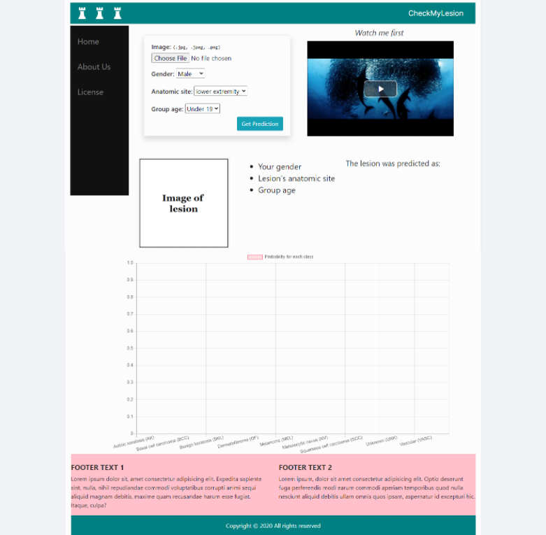

# Django-AI

### This is a webservice for skin lesion diagnosis.
The model was trained on the ISIC 2019 dataset, on a multiclass classification with
a weight implementation for the Melanoma and Squamous cell carcinoma classes.

